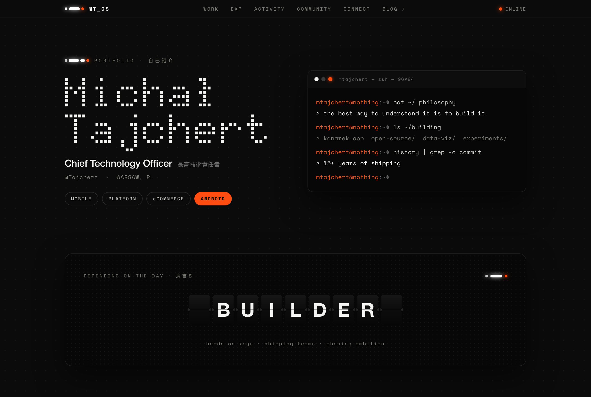

# Michał Tajchert — Portfolio

A single-page personal portfolio for **Michał Tajchert** (CTO), built in a
custom **TE × Nothing** retro-futurism visual language — dot-matrix type, a
split-flap role display, a mechanical contribution heatmap, and a terminal
readout, all on a dark, engineered surface.

🔗 **Live:** [mtajchert.com](https://mtajchert.com)



## Highlights

- **Dot-matrix wordmark** and a full-bleed dot-grid background.
- **Split-flap (Solari) role display** — a real mechanical-board animation that
  rattles each character forward to its target, cycling through roles
  (Builder · Engineer · Manager · Mentor · Gamer · Developer · Speaker) at
  random, holding each word for two seconds after it settles.
- **Live contribution heatmap** — pulls GitHub + GitLab activity from
  [commitgraph.mtajchert.com](https://commitgraph.mtajchert.com), merges a
  rolling 53-week window, caches in `localStorage`, shows a shimmer while
  loading, and degrades gracefully to placeholder data if the API is down.
- **Terminal readout**, a **continuous-spine experience/education timeline**
  with nested roles, and a **copy/download CV** card (the CV is a single
  markdown file imported at build time).
- **No horizontal overflow** from 320–1280px; the in-page nav collapses on phones.
- Semantic landmarks, heading hierarchy, and `Person` / `ProfilePage` JSON-LD
  for SEO.

## Tech stack

| Area | Choice |
| --- | --- |
| Framework | **[Astro 4](https://astro.build)**, `output: 'static'` (no SSR, no server runtime) |
| Interactivity | **Vanilla Web Components** (self-registering custom elements — no React/Vue/Svelte) |
| Styling | **CSS custom properties** (`--rf-*` design tokens), no CSS framework |
| Logic & tests | **TypeScript** (strict) for pure logic, **Vitest** for unit tests |
| Hosting | **Cloudflare Pages** (static, zero build-time secrets) |

## Run locally

```bash
npm install
npm run dev      # http://localhost:4321
npm run build    # static output → dist/
npm run preview  # serve the built dist/ at http://localhost:4321
npm test         # unit tests (contribution-graph + split-flap logic)
```

> **Preview over a server, never via `file://`.** Opening `dist/index.html`
> directly loads the CSS but browsers block ES-module scripts on a `file://`
> origin (CORS), so the interactive web components won't render. Use
> `npm run preview` (or any static server, e.g. `npx serve dist`). This is only
> a local concern — Cloudflare Pages serves over HTTPS, where it works fine.

## Project structure

```
src/
  styles/                 design tokens, themes, keyframes, base + page-local CSS
  components/             reusable design-system components (vendored)
  web-components/         vanilla custom elements (split-flap, contrib-graph, cv-actions)
  components/portfolio/   this site's sections (Hero, Experience, Education, …)
  layouts/Base.astro      dark-locked layout + <head> meta + JSON-LD
  pages/index.astro       composes the sections
  config.ts               single source of truth (e.g. BLOG_URL)
michal-tajchert-cv.md     the CV — imported `?raw` at build (single source)
public/                   favicon, og image, robots.txt, sitemap.xml
```

`src/styles`, `src/components`, and `src/web-components` are vendored copies of
a private retro-futurism design system; the page-specific sections live in
`src/components/portfolio/`.

## Deploy

Static build deployed to Cloudflare Pages:

```bash
npm run build
npx wrangler pages deploy dist --project-name=mtajchert-portfolio --branch=main
```

Build command `npm run build`, output directory `dist`, framework preset Astro.
Fully static — no env vars or build-time secrets.

## License

[MIT](LICENSE) © 2026 Michał Tajchert
